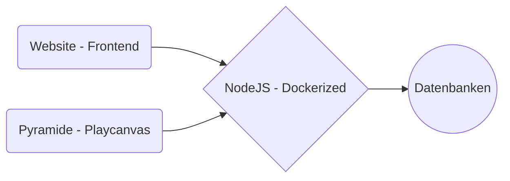

# Node Backend for HTBLA Leonding Avatar

### Docker:
#### docker-compose.yml
```yml
version: '3'

services:
  reverse-proxy:
    #restart: always
    image: traefik:1.7
    command: --api --docker 
    ports:
      - "80:80"     # The HTTP port
      - "8080:8080" # The Web UI (enabled by --api)
      #- "443:443" # SSL Port for HTTPS
    volumes:
      - /var/run/docker.sock:/var/run/docker.sock:ro 
      - ./traefik.toml:/etc/traefik/traefik.toml
      #- ./acme.json:/acme.json # SSL Certificate
    network_mode: bridge

  app:
    build:
      dockerfile: Dockerfile
      context: ./docker/app
    #restart: always
    user: "node"
    working_dir: /home/node/app
    ports:
      - "3000:3000"
    command: npm start
    links:
      - mongo
    depends_on:
      - mongo
      - reverse-proxy
    labels:
      - traefik.enable=true
      - traefik.frontend.rule=Host:vm65.htl-leonding.ac.at
    network_mode: bridge

...
```
#### Dockerfile:
```docker
FROM node:8
RUN mkdir -p /home/node/app
WORKDIR /home/node/app
COPY package*.json /home/node/app/
RUN npm install
COPY . /home/node/app/
EXPOSE 3000
CMD [ "npm", "start" ]
``` 
#### Package.json
```json
{
  "name": "Leonie-Node",
  "version": "1",
  "description": "Backend for Leonie",
  "main": "server.js",
  "scripts": {
    "start": "node server.js"
  },
  "dependencies": {
    "body-parser": "^1.18.3",
    "express": "^4.15.5",
    "socket.io": "^2.2.0"
  }
}
```
### Server:
#### NodeJS -> Dockered with docker-compose
#### Socket.io:
##### Init (Express + Socket IO):
```javascript
  var express = require("express");
  var app = express();
  var http = require("http").Server(app);
  var io = require("socket.io")(http);
```
##### Socket - Server:
```javascript
    var io = require("socket.io")(http);
    io.emit("anim", req.body.animation);  
```
#### Express.js:
##### REST:
```javascript
  app.get("/", function(req, res) {
  res.send("<h1> Nothing here just a teapot </h1>");
});
app.post("/sendAnim", function(req, res) {
  io.emit("anim", req.body.animation);
  res.status(204);
  res.send();
});

```
